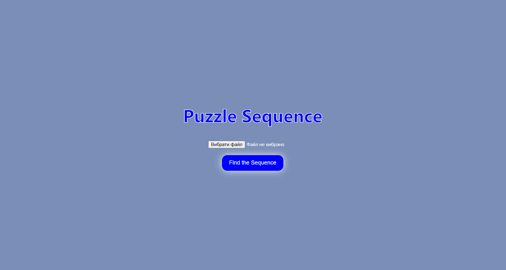
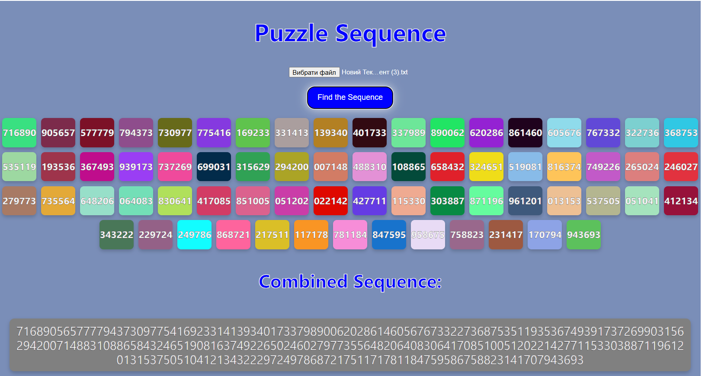

# **Puzzle Sequence**

Puzzle Sequence - це ефективний та швидкий інструмент для роботи з великими масивами чисел, який дозволяє користувачам знаходити логічні послідовності чисел із файлів без необхідності вручну перевіряти кожен елемент.

## **Опис**

це веб-застосунок для обробки великих файлів з числами у форматі 6-значних чисел. За допомогою алгоритму пошуку послідовностей, застосунок знаходить найбільшу ланцюжок чисел, що мають спільні цифри на межі. Результат обробки представлений у вигляді пазлів, де кожен елемент пазла є числом, яке відповідає певній частині великої послідовності. Ви можете завантажити текстовий файл, і застосунок автоматично знайде та відобразить найбільшу послідовність чисел, згенеровану на основі цього файлу.

## **Особливості**

1. Завантаження файлів:

+ Користувач може завантажити файл у форматі .txt з 6-значними числами.
+ Підтримується обробка великих файлів, що дозволяє розбивати їх на частини для більш ефективної обробки.

2. Пошук послідовностей:

+ Алгоритм знаходить найбільшу ланцюжок чисел, де останні дві цифри одного числа збігаються з першими двома цифрами наступного.
+ Результат виводиться у вигляді чисел, представлених як пазли.

3. Зв'язування чисел:

+ Після пошуку найбільшої послідовності, з'єднані числа виводяться у вигляді рядка, що відображає завершену послідовність.

4. Інтерфейс:

+ Зручний та інтуїтивно зрозумілий інтерфейс, що дозволяє користувачеві завантажити файл і переглянути результат за кілька секунд.

5. Різнокольорові пазли:

+ Кожен пазл має випадковий колір, щоб користувачам було цікаво працювати з результатами.

6. Лоадер:

+ Для великих файлів застосунок використовує лоадер, щоб вказати користувачеві, що обробка ще триває.

